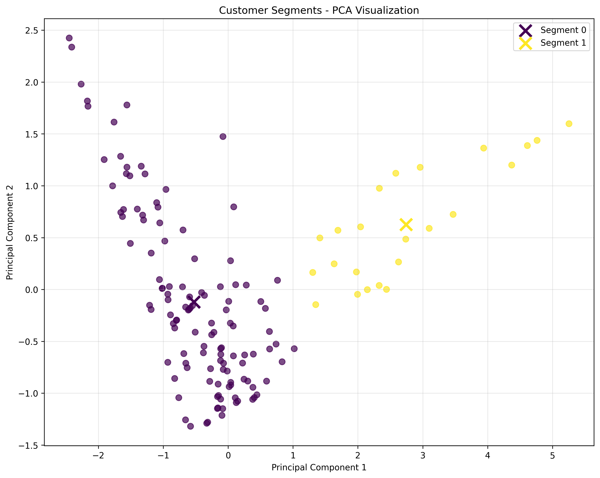

# Customer Segmentation Project


# Customer Segmentation — RFM + Clustering

**From raw transactions to actionable segments in minutes.**



**[Try it now with Streamlit →](#step-6-streamlit-demo-try-it-locally)**

---
## Project Description

This project implements customer segmentation using RFM (Recency, Frequency, Monetary) analysis and machine learning clustering techniques. The goal is to identify distinct customer segments to enable targeted marketing strategies and improve customer relationship management.

### What is Customer Segmentation?

Customer segmentation is the process of dividing customers into groups based on shared characteristics. This project focuses on behavioral segmentation using RFM analysis, which is a proven methodology for understanding customer value and behavior patterns.

## Dataset

### Primary Dataset
- **Kaggle Dataset**: [Online Retail Dataset (UCI)](https://www.kaggle.com/datasets/mathchi/online-retail-ii-data-set-from-real-ecommerce-company)
- **Source**: UCI Machine Learning Repository
- **Description**: Online retail transaction data from a UK-based e-commerce company

### Simulated Dataset
Since the Kaggle dataset may not always be available, this project includes a reproducible simulated dataset with the following characteristics:
- **Columns**: CustomerID, InvoiceDate, InvoiceNo, Quantity, UnitPrice
- **Time Period**: 2 years of transaction data (2022-2024)
- **Customers**: 1,000 unique customers
- **Transactions**: 5,000 total transactions
- **Reproducibility**: Uses `np.random.seed(42)` for consistent results

## Methodology

### Step 1: RFM Analysis
RFM (Recency, Frequency, Monetary) analysis is a marketing technique used to determine customer value by examining:

1. **Recency (R)**: How recently a customer has made a purchase
   - Measured in days since last purchase
   - Lower values indicate more recent activity

2. **Frequency (F)**: How often a customer makes a purchase
   - Total number of transactions
   - Higher values indicate more frequent purchases

3. **Monetary (M)**: How much money a customer spends
   - Total spending amount across all transactions
   - Higher values indicate higher customer value

### Step 2: Data Scaling
Before applying clustering algorithms, RFM metrics are standardized using `StandardScaler` from scikit-learn. This is crucial because:

- **Different Scales**: RFM metrics have vastly different scales (e.g., Recency: 1-723 days, Monetary: $214-$108,384)
- **Clustering Performance**: Algorithms like K-means are sensitive to feature scales
- **Fair Comparison**: Ensures all features contribute equally to the clustering process

**Scaling Process**:
- **StandardScaler**: Transforms features to have mean=0 and standard deviation=1
- **Formula**: `z = (x - μ) / σ` where μ is the mean and σ is the standard deviation
- **Result**: All features are on the same scale for fair clustering

**Example Scaled Data**:
```
CustomerID  Recency_Scaled  Frequency_Scaled  Monetary_Scaled
CUST_0001       -0.871         -0.228        -1.214
CUST_0002        2.568         -0.706        -0.355
CUST_0003       -0.793          0.729         0.598
CUST_0004        0.704         -0.706        -0.722
```

**Testing**: Pytest tests (`tests/test_scaling.py`) verify that scaled features have mean ≈ 0 and std ≈ 1 within tolerance.

### Step 3: KMeans Clustering & Model Selection
After scaling the RFM data, we use KMeans clustering to group customers into distinct segments. The optimal number of clusters (k) is determined using multiple validation metrics:

**K-Selection Process**:
- **Range**: Test k values from 2 to 10
- **Primary Criterion**: Maximum Silhouette Score (measures cluster cohesion and separation)
- **Tie-breaker 1**: Highest Calinski-Harabasz Index (ratio of between-cluster to within-cluster dispersion)
- **Tie-breaker 2**: Lowest Davies-Bouldin Index (average similarity measure, lower is better)

**Validation Metrics Used**:
- **Inertia**: Sum of squared distances to centroids (for Elbow method)
- **Silhouette Score**: Range [-1, 1], higher values indicate better clustering
- **Calinski-Harabasz Index**: Higher values indicate better-defined clusters
- **Davies-Bouldin Index**: Lower values indicate better clustering

**Results**: For our dataset, the optimal k=3 was selected based on the highest Silhouette Score.

**Generated Artifacts**:
- `data/processed/labels_k3.csv` - Customer segment assignments
- `data/processed/rfm_with_segment.csv` - Original RFM data with segment labels
- `models/kmeans_k3.joblib` - Trained KMeans model for future predictions

**Visualizations Created**:
- `reports/figures/elbow_inertia.png` - Elbow plot showing inertia vs k
- `reports/figures/silhouette_scores.png` - Silhouette scores for different k values
- `reports/figures/cluster_validity_indices.png` - Calinski-Harabasz and Davies-Bouldin indices
- `reports/figures/pca_scatter_k3.png` - 2D PCA visualization of clusters
- `reports/figures/heatmap_rfm_by_segment_k3.png` - RFM profile heatmap by segment

**Segment Interpretation Checklist**:
- **High Monetary, Low Frequency**: Premium customers who make large but infrequent purchases
- **High Recency (inactive)**: Customers who haven't purchased recently (at-risk)
- **VIP Segments**: High Monetary + High Frequency + Low Recency
- **Bargain Hunters**: Low Monetary + High Frequency
- **Occasional Customers**: Low Frequency + Low Monetary

### Step 4: Alternative Clustering Methods
To validate and compare with KMeans results, we implemented two additional clustering approaches:

**DBSCAN (Density-Based Spatial Clustering of Applications with Noise)**:
- **Advantage**: Can detect outliers and clusters of varying shapes and densities
- **Parameters**: eps (neighborhood radius) and min_samples (minimum points to form cluster)
- **Results**: Best configuration found with eps=0.5, min_samples=5, yielding 3 clusters and 70 noise points
- **Use Case**: Better when you want to identify outliers or when clusters have irregular shapes

**Hierarchical Clustering (Agglomerative with Ward Linkage)**:
- **Advantage**: Creates a tree structure showing relationships between clusters
- **Parameters**: n_clusters (number of clusters) and linkage method (Ward)
- **Results**: Best configuration found with k=2 clusters using Ward linkage
- **Use Case**: Better when you want to understand the hierarchical structure of customer relationships

**Generated Artifacts**:
- `data/processed/dbscan_labels.csv` - DBSCAN segment assignments
- `data/processed/hierarchical_labels.csv` - Hierarchical segment assignments
- `data/processed/rfm_with_dbscan.csv` - RFM data with DBSCAN segments
- `data/processed/rfm_with_hierarchical.csv` - RFM data with hierarchical segments
- `models/dbscan_best.joblib` - Trained DBSCAN model
- `models/hierarchical_k2.joblib` - Trained hierarchical model

**Visualizations Created**:
- `reports/figures/dbscan_scatter.png` - DBSCAN clusters with noise points highlighted
- `reports/figures/hierarchical_dendrogram.png` - Dendrogram showing cluster hierarchy
- `reports/figures/hierarchical_scatter.png` - Hierarchical clustering results
- `reports/figures/clustering_comparison.csv` - Comparative metrics table

**Method Selection Guidelines**:
- **Use KMeans**: When you expect spherical, well-separated clusters of similar sizes
- **Use DBSCAN**: When you want to detect outliers or have clusters of varying densities
- **Use Hierarchical**: When you want to understand the hierarchical structure of customer relationships

### Step 5: Segment Profiling & Reporting
Transform clustering results into actionable business insights with comprehensive profiling and automated reporting:

**Segment Profiling Features**:
- **Per-segment KPIs**: Customer count, revenue share, average RFM metrics, churn risk indicators
- **Business Labeling**: Automatic assignment of human-readable labels (VIP Loyal, At-Risk, Regulars, etc.)
- **Statistical Analysis**: Mean, median, and distribution analysis for each RFM metric per segment
- **Revenue Analysis**: Revenue contribution and share calculations per segment

**Visualizations for Stakeholders**:
- **Segment Size Charts**: Bar charts showing customer distribution and share percentages
- **Revenue Share Analysis**: Visual representation of revenue contribution by segment
- **RFM Heatmaps**: Normalized heatmaps showing segment RFM profiles for easy comparison
- **Distribution Boxplots**: Statistical distributions of R, F, M values across segments

**Automated Reporting**:
- **Markdown Reports**: Comprehensive `reports/segment_report.md` with executive summary, insights, and recommendations
- **HTML Reports**: Web-friendly `reports/segment_report.html` for easy sharing and presentation
- **Segment Narratives**: Template-based descriptions and campaign ideas for each segment
- **Business Recommendations**: Actionable insights and next steps for marketing teams

**Generated Artifacts**:
- `data/processed/segment_profiles.csv` - Comprehensive segment statistics and KPIs
- `data/processed/customer_segments_final.csv` - Customer data with segment assignments
- `data/processed/customer_segments_labeled.csv` - Customer data with business labels
- `data/processed/segment_narratives.csv` - Segment descriptions and campaign ideas
- `reports/figures/segments_size_bar.png` - Segment size visualization
- `reports/figures/segments_revenue_share.png` - Revenue share visualization
- `reports/figures/segments_rfm_heatmap.png` - RFM profile heatmap
- `reports/figures/segments_rfm_boxplots.png` - RFM distribution plots
- `reports/segment_report.md` - Comprehensive markdown report
- `reports/segment_report.html` - HTML version of the report

**Business Label Categories**:
- **VIP Loyal**: High monetary + high frequency + low recency (most valuable customers)
- **High-Value Rare Buyers**: High monetary + low frequency + low recency (occasional big spenders)
- **Regulars**: Medium RFM values (consistent moderate customers)
- **At-Risk / Inactive**: High recency + low frequency (customers at risk of churning)
- **General**: Mixed RFM characteristics (diverse customer group)

**Usage Instructions**:
- Run `python src/interpretation_reporting.py` to generate all profiling and reporting outputs
- Modify `CLUSTER_SOURCE` variable in the script to switch between KMeans, DBSCAN, or Hierarchical results
- Use `pytest -q` to verify all reporting outputs are correctly generated
- Share the generated reports with stakeholders for business decision-making

### Step 6: Streamlit Demo (Try It Locally)
Interactive web application for real-time customer segmentation analysis:

**Features**:
- **File Upload**: Upload your own CSV transaction data or use built-in sample data
- **Algorithm Selection**: Choose between KMeans, DBSCAN, or Hierarchical clustering
- **Parameter Tuning**: Adjust clustering parameters via interactive sliders
- **Real-time Analysis**: View RFM summary, clustering metrics, and visualizations instantly
- **Download Results**: Export segments and RFM data as CSV files
- **Caching**: Heavy computations are cached for better performance

**How to Use**:
1. **Launch the app**:
   ```bash
   streamlit run streamlit_app/app.py
   ```

2. **Upload Data**: Either upload a CSV file with columns `CustomerID`, `InvoiceDate`, `InvoiceNo`, `Quantity`, `UnitPrice`, or check "Use sample data"

3. **Configure Clustering**:
   - **KMeans**: Adjust number of clusters (2-10)
   - **DBSCAN**: Adjust eps (0.1-2.0) and min_samples (2-20)
   - **Hierarchical**: Adjust number of clusters (2-10)

4. **View Results**:
   - RFM summary statistics
   - Clustering validation metrics (Silhouette, Calinski-Harabasz, Davies-Bouldin)
   - 2D PCA visualization of clusters
   - Segment profile heatmap
   - Download buttons for results

**Technical Notes**:
- **Metrics**: Silhouette score ranges from -1 to 1 (higher is better)
- **Limitations**: Large datasets (>10,000 customers) may be slow; consider sampling
- **Caching**: Results are cached based on input data and parameters for faster re-runs
- **Error Handling**: Graceful handling of invalid data and clustering failures

**Generated Artifacts**:
- `data/processed/rfm_table.csv` - RFM metrics computed from uploaded data
- `data/processed/rfm_scaled.csv` - Scaled RFM data for clustering
- `data/processed/segments_app.csv` - Customer segment assignments from the app

**Testing**:
- Run `pytest tests/test_app_core.py -v` to test the core functionality
- Tests cover data loading, RFM computation, scaling, clustering algorithms, and evaluation metrics

### Step 7: Packaging & CI
Professional development setup with automated quality checks and continuous integration:

**Development Environment Setup**:
```bash
# One-time setup
make install
```

**Local Development Workflow**:
```bash
# Format, lint, and test
make fmt && make lint && make test

# Or run all checks at once
make check

# Run with coverage
make test-cov

# Start the Streamlit app
make app

# Clean up cache and build artifacts
make clean
```

**CI Pipeline**:
The GitHub Actions CI runs on every push and pull request:
- **Matrix Testing**: Python 3.11 and 3.12 on Ubuntu
- **Code Quality**: ruff linting, black formatting check, isort import sorting
- **Testing**: pytest with coverage reporting
- **Coverage**: Automatic upload to Codecov (if token provided)

**Pre-commit Hooks**:
Automated checks run before each commit:
- **Code Formatting**: black, ruff --fix, isort
- **File Hygiene**: trailing whitespace, end-of-file fixer
- **Quality Checks**: YAML validation, large file detection

**Manual Pre-commit Run**:
```bash
pre-commit run --all-files
```

**Project Structure**:
- **`pyproject.toml`**: Centralized configuration for all tools
- **`Makefile`**: Windows-friendly development commands
- **`.pre-commit-config.yaml`**: Automated quality checks
- **`.github/workflows/ci.yml`**: GitHub Actions CI pipeline
- **`requirements.txt`**: Development dependencies included

**Quality Standards**:
- **Line Length**: 88 characters (black default)
- **Import Sorting**: isort with black profile
- **Linting**: ruff with common rules (E, F, I, UP, PL, W)
- **Testing**: pytest with coverage reporting
- **Notebook Hygiene**: Clean metadata on commit

### Clustering Approach
The project uses machine learning clustering algorithms to group customers based on their RFM scores:
- **K-means Clustering**: Primary segmentation method
- **Hierarchical Clustering**: Alternative approach for validation
- **Silhouette Analysis**: Optimal cluster number determination

## Folder Structure

```
customer-segmentation/
│
├── data/
│   ├── raw/                    # Original/simulated transaction data
│   │   └── sample_transactions.csv
│   └── processed/              # Cleaned and processed data
│       ├── rfm_table.csv       # RFM metrics per customer
│       ├── rfm_scaled.csv      # Scaled RFM data for clustering
│       ├── labels_k3.csv       # KMeans customer segment assignments
│       ├── rfm_with_segment.csv # RFM data with KMeans segment labels
│       ├── dbscan_labels.csv   # DBSCAN segment assignments
│       ├── rfm_with_dbscan.csv # RFM data with DBSCAN segment labels
│       ├── hierarchical_labels.csv # Hierarchical segment assignments
│       ├── rfm_with_hierarchical.csv # RFM data with hierarchical segment labels
│       ├── segment_profiles.csv # Segment profiling statistics and KPIs
│       ├── customer_segments_final.csv # Customer data with segment assignments
│       ├── customer_segments_labeled.csv # Customer data with business labels
│       └── segment_narratives.csv # Segment descriptions and campaign ideas
├──    # Step 1: RFM analysis
│   ├── 02_clustering.ipynb     # Step 3: KMeans clustering analysis
│   ├── 03_alternative_clustering.ipynb # Step 4: Alternative clustering methods
│   └── 04_interpretation_reporting.ipynb # Step 5: Segment profiling and reporting
├── src/                        # Python source code
│   ├── rfm_analysis.py         # Step 1: RFM analysis
│   ├── rfm_scaling.py          # Step 2: Data scaling
│   ├── interpretation_reporting.py # Step 5: Segment profiling and reporting
│   └── app_core.py             # Step 6: Core logic for Streamlit app
├── tests/                      # Pytest test suite
│   ├── __init__.py
│   ├── conftest.py             # Pytest configuration and fixtures
│   ├── test_scaling.py         # Scaling tests
│   ├── test_clustering.py      # KMeans clustering tests
│   ├── test_alternative_clustering.py # Alternative clustering tests
│   ├── test_reporting.py       # Segment profiling and reporting tests
│   └── test_app_core.py        # Step 6: Streamlit app core logic tests
├── models/                     # Trained machine learning models
│   ├── kmeans_k3.joblib        # KMeans clustering model
│   ├── dbscan_best.joblib      # DBSCAN clustering model
│   └── hierarchical_k2.joblib  # Hierarchical clustering model
├── streamlit_app/              # Interactive web application
│   └── app.py                  # Step 6: Streamlit UI
├── reports/                    # Generated reports and visualizations
│   ├── figures/                # Clustering validation plots and comparisons
│   ├── segment_report.md       # Comprehensive markdown report
│   └── segment_report.html     # HTML version of the report
├── requirements.txt            # Python dependencies
└── README.md                   # Project documentation
```

## Tech Stack

### Core Libraries
- **pandas**: Data manipulation and analysis
- **numpy**: Numerical computing
- **scikit-learn**: Machine learning algorithms
- **matplotlib**: Static plotting
- **seaborn**: Statistical data visualization
- **plotly**: Interactive visualizations

### Development Tools
- **jupyter**: Interactive notebooks
- **streamlit**: Web application framework
- **openpyxl**: Excel file handling
- **xlrd**: Legacy Excel file support

### Optional Integrations
- **OpenAI API**: AI-powered insights and commentary
- **plotly-dash**: Advanced interactive dashboards

## Usage

### Quick Start

1. **Clone the repository**:
   ```bash
   git clone <repository-url>
   cd customer-segmentation
   ```

2. **Install dependencies**:
   ```bash
   pip install -r requirements.txt
   ```

3. **Run the RFM analysis**:
   ```bash
   python src/rfm_analysis.py
   ```

4. **Scale the RFM data**:
   ```bash
   python src/rfm_scaling.py
   ```

5. **Test the scaling**:
   ```bash
   pytest -q tests/test_scaling.py
   ```

6. **Run clustering analysis**:
   ```bash
   
   ```

7. **Run alternative clustering analysis**:
   ```bash
   
   ```

8. **Run segment profiling and reporting**:
   ```bash
   python src/interpretation_reporting.py
   ```

9. **Run all tests**:
   ```bash
   pytest -q
   ```

10. **Try the interactive Streamlit app**:
    ```bash
    streamlit run streamlit_app/app.py
    ```

11. **Open **:
    ```bash
    
    ```

### Running the Analysis

#### Option 1: Python Scripts (Step by Step)
```bash
# Step 1: RFM Analysis
python src/rfm_analysis.py

# Step 2: Data Scaling
python src/rfm_scaling.py

# Step 3: Test Scaling
pytest -q tests/test_scaling.py

# Step 4: Run Clustering
python src/clustering.py

# Step 5: Run Alternative Clustering
python src/alternative_clustering.py

# Step 6: Run Segment Profiling & Reporting
python src/interpretation_reporting.py

# Step 7: Run All Tests
pytest -q

# Step 8: Generate Portfolio Assets
python scripts/make_portfolio_assets.py

# Step 9: Data Cleaning & Validation (NEW!)
python scripts/run_cleaning.py --input data/sample/online_retail_sample.csv

# Step 10: Try the Interactive Streamlit App
streamlit run streamlit_app/app.py
```


## Step X: Data Cleaning & Validation (Analyze first, Apply on approval)

Robust data cleaning with two-phase workflow: **ANALYZE** (detect issues, propose fixes) and **APPLY** (execute approved plan).

### Analyze Mode (Dry-Run)
Detects schema/type issues, duplicates, invalid values, outliers, thin customers. Writes human-readable reports:

- `reports/cleaning_report.md` - Detailed analysis and proposed plan
- `reports/cleaning_findings.json` - Machine-readable findings

### Apply Mode
Executes the approved plan and writes cleaned outputs:

- `data/processed/transactions_cleaned.csv` - Cleaned transaction data
- `data/processed/transactions_rejected.csv` - Rows that were removed
- `data/processed/transactions_issues_catalog.csv` - Detailed issue tracking

### Usage

```bash
# Analyze (no changes)
python scripts/run_cleaning.py --input data/sample/online_retail_sample.csv

# Apply after approval
python scripts/run_cleaning.py --input data/sample/online_retail_sample.csv --apply

# Apply an approved plan exactly
python scripts/run_cleaning.py --input data/sample/online_retail_sample.csv --apply --plan-from path/to/plan.json
```

### Configuration
See `config/cleaning_rules.yml` for thresholds and choices (drop vs winsorize vs flag).

### Tests
```bash
pytest -q tests/test_cleaning.py
```

### Features
- **Schema Validation**: Ensures required columns and data types
- **Type Coercion**: Smart parsing of dates and numeric values
- **Duplicate Detection**: Exact and near-duplicate identification
- **Outlier Handling**: IQR-based detection with winsorization/dropping options
- **Business Rules**: Invalid quantities/prices, thin customers, date range validation
- **Audit Trail**: Complete tracking of what was changed and why
- **Configurable**: YAML-based rules for easy customization

### Expected Output
- Raw transaction data saved to `data/raw/sample_transactions.csv`
- RFM metrics table saved to `data/processed/rfm_table.csv`
- Scaled RFM data saved to `data/processed/rfm_scaled.csv`
- Customer segments saved to `data/processed/labels_k3.csv`
- Merged RFM data with segments saved to `data/processed/rfm_with_segment.csv`
- Trained KMeans model saved to `models/kmeans_k3.joblib`
- DBSCAN segments saved to `data/processed/dbscan_labels.csv`
- Hierarchical segments saved to `data/processed/hierarchical_labels.csv`
- Alternative clustering models saved to `models/`
- Validation plots and comparisons saved to `reports/figures/`
- Segment profiling data saved to `data/processed/`
- Comprehensive reports saved to `reports/`
- Console output showing:
  - Dataset generation statistics
  - Data cleaning results
  - RFM metrics for first 10 customers
  - Scaling statistics (mean ≈ 0, std ≈ 1)
  - Clustering validation metrics
  - Optimal k selection (k=3)
  - Segment distribution
  - Alternative clustering results (DBSCAN, Hierarchical)
  - Comparative analysis metrics
  - Segment profiling and business labeling
  - Automated report generation
  - Summary statistics
  - Streamlit app running on localhost with interactive interface

## Future Work

### Phase 2: Advanced Segmentation ✅ COMPLETED
- [x] Implement K-means clustering on RFM scores
- [x] Add hierarchical clustering for validation
- [x] Create segment profiles and characteristics
- [x] Develop segment-specific marketing strategies

### Phase 3: Interactive Dashboard
- [ ] Build Streamlit web application
- [ ] Create interactive visualizations
- [ ] Add real-time data upload capability
- [ ] Implement segment comparison tools

### Phase 4: SaaS Integration
- [ ] Database integration (PostgreSQL/MongoDB)
- [ ] API development for external access
- [ ] Automated reporting and alerts
- [ ] Multi-tenant architecture

### Phase 5: AI Enhancement
- [ ] OpenAI API integration for insights
- [ ] Automated segment naming and description
- [ ] Predictive customer behavior modeling
- [ ] Natural language query interface

### Step 8: Portfolio Assets & Quick Demo

This step creates professional portfolio assets and provides a quick demo experience for showcasing the project.

#### Sample Datasets
- **Main Dataset**: `data/sample/online_retail_sample.csv` (~600 rows, 143 customers)
- **Tiny Dataset**: `data/sample/online_retail_tiny.csv` (~20 rows, 8 customers)
- **Schema**: CustomerID, InvoiceDate, InvoiceNo, Quantity, UnitPrice
- **Features**: Deterministic generation with realistic customer behavior patterns

#### Portfolio Figures
- **PCA Scatter**: `reports/figures/hero_pca_scatter.png` - Customer segments visualization
- **RFM Heatmap**: `reports/figures/hero_rfm_heatmap.png` - Average RFM values by segment
- **Segment Sizes**: `reports/figures/hero_segments_size.png` - Customer distribution by segment
- **Revenue Share**: `reports/figures/hero_revenue_share.png` - Revenue distribution by segment

#### Quick Demo GIF
- **Animated Overview**: `reports/figures/quicklook.gif` - Stitched portfolio figures
- **Requirements**: `imageio` package for GIF generation
- **Fallback**: Graceful skip if imageio not available

#### Try Quickly with Streamlit
```bash
# Install dependencies
make install

# Run Streamlit app
streamlit run streamlit_app/app.py

# In the app: check "Use sample data" for instant demo
```

#### Regenerate Assets
```bash
# Generate all portfolio assets
make assets

# Or run directly
python scripts/make_portfolio_assets.py
```

#### Segment Profiles
- **CSV Output**: `reports/figures/portfolio_segment_profiles.csv`
- **Columns**: segment, n_customers, share_customers, revenue_share, avg_recency, avg_frequency, avg_monetary
- **Validation**: Customer and revenue shares sum to 1.0 (within 1e-6 tolerance)

## Contributing

1. Fork the repository
2. Create a feature branch (`git checkout -b feature/amazing-feature`)
3. Commit your changes (`git commit -m 'Add amazing feature'`)
4. Push to the branch (`git push origin feature/amazing-feature`)
5. Open a Pull Request

## License

This project is licensed under the MIT License - see the [LICENSE](LICENSE) file for details.

## Acknowledgments

- UCI Machine Learning Repository for the original dataset
- Kaggle community for dataset hosting and discussions
- RFM analysis methodology pioneers in marketing science

---

**Note**: This project is designed for educational and research purposes. When using with real customer data, ensure compliance with data protection regulations (GDPR, CCPA, etc.).
