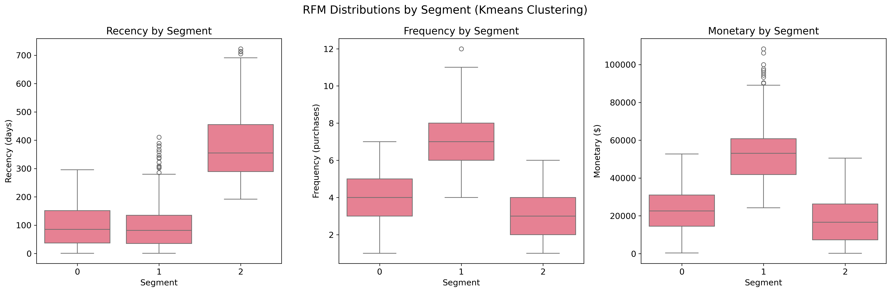

# Customer Segmentation Report

**Generated:** 2025-08-27 02:15:54
**Clustering Method:** Kmeans
**Number of Segments:** 3

## Executive Summary

This report presents the results of customer segmentation analysis using Kmeans clustering.
The analysis identified 3 distinct customer segments based on RFM (Recency, Frequency, Monetary) metrics.

## Segment Overview

### Segment Profiles

| Segment | Customers | Share | Avg Recency | Avg Frequency | Avg Monetary | Revenue Share | At-Risk % |
|---------|-----------|-------|-------------|---------------|--------------|--------------|-----------|
| 0.0 | 511.0 | 51.6% | 98 days | 3.7 | $22,874 | 38.0% | 7.6% |
| 1.0 | 291.0 | 29.4% | 98 days | 6.9 | $53,962 | 51.1% | 8.6% |
| 2.0 | 188.0 | 19.0% | 384 days | 2.7 | $17,890 | 10.9% | 97.9% |

## Visualizations

### Segment Sizes

### Revenue Share by Segment

### RFM Profile Heatmap

### RFM Distributions

## Key Insights

### Interpretation Checklist

**What stands out:**

- **Highest Revenue Segment:** Segment 1.0 contributes 51.1% of total revenue
- **Largest Segment:** Segment 0.0 has 511.0 customers (51.6% of total)
- **Highest Risk Segment:** Segment 2.0 has 97.9% customers at risk of churning

**VIP Customers:** Look for segments with high monetary value and low recency
**At-Risk Customers:** Focus on segments with high recency (inactive) and low frequency
**Growth Opportunities:** Target segments with medium RFM values for upselling

## Segment Narratives

### Segment 0: General

**Description:** Segment 0.0 represents a diverse group of customers with mixed RFM characteristics. They may include new customers or those with irregular purchasing patterns.

**Campaign Ideas:** Welcome campaigns for new customers, general promotions, cross-selling opportunities

---

### Segment 1: General

**Description:** Segment 1.0 represents a diverse group of customers with mixed RFM characteristics. They may include new customers or those with irregular purchasing patterns.

**Campaign Ideas:** Welcome campaigns for new customers, general promotions, cross-selling opportunities

---

### Segment 2: General

**Description:** Segment 2.0 represents a diverse group of customers with mixed RFM characteristics. They may include new customers or those with irregular purchasing patterns.

**Campaign Ideas:** Welcome campaigns for new customers, general promotions, cross-selling opportunities

---

## Recommendations

1. **Immediate Actions:**
   - Implement targeted campaigns for at-risk segments
   - Develop loyalty programs for high-value customers
   - Create re-engagement strategies for inactive customers

2. **Strategic Initiatives:**
   - Monitor segment evolution over time
   - A/B test different approaches for each segment
   - Develop segment-specific product offerings

3. **Next Steps:**
   - Set up automated segment monitoring
   - Implement real-time customer scoring
   - Develop predictive models for customer lifetime value

---
*Report generated automatically by Customer Segmentation Analysis Pipeline*